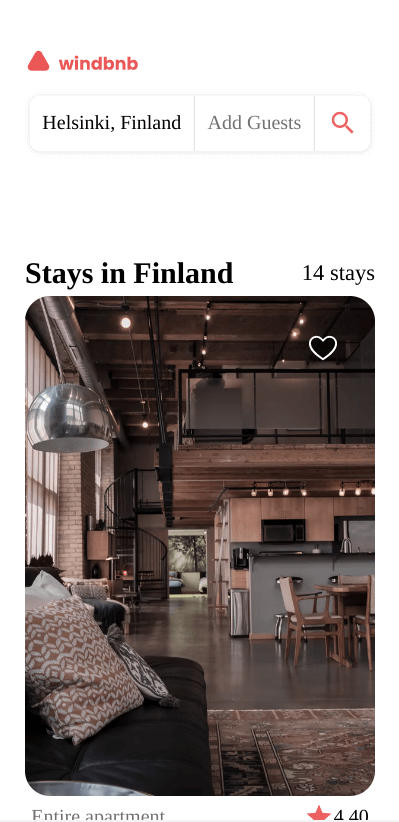
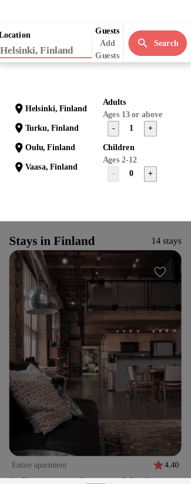
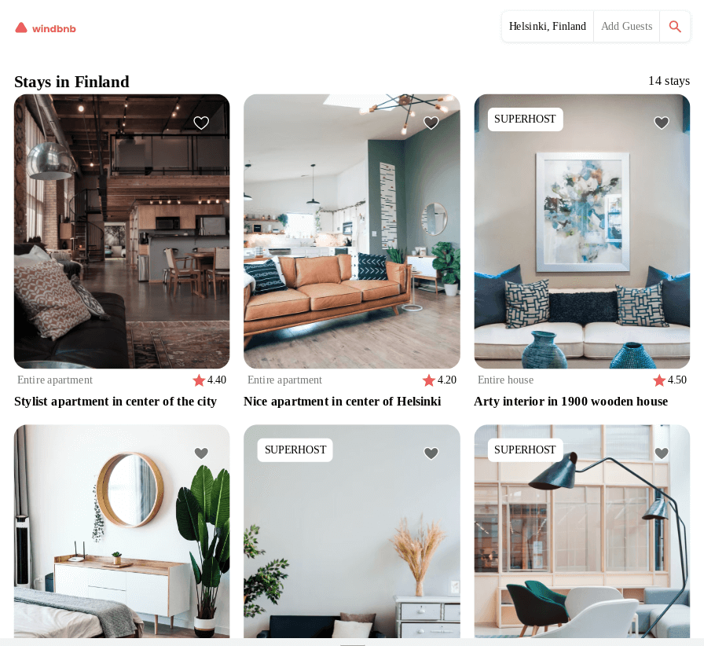
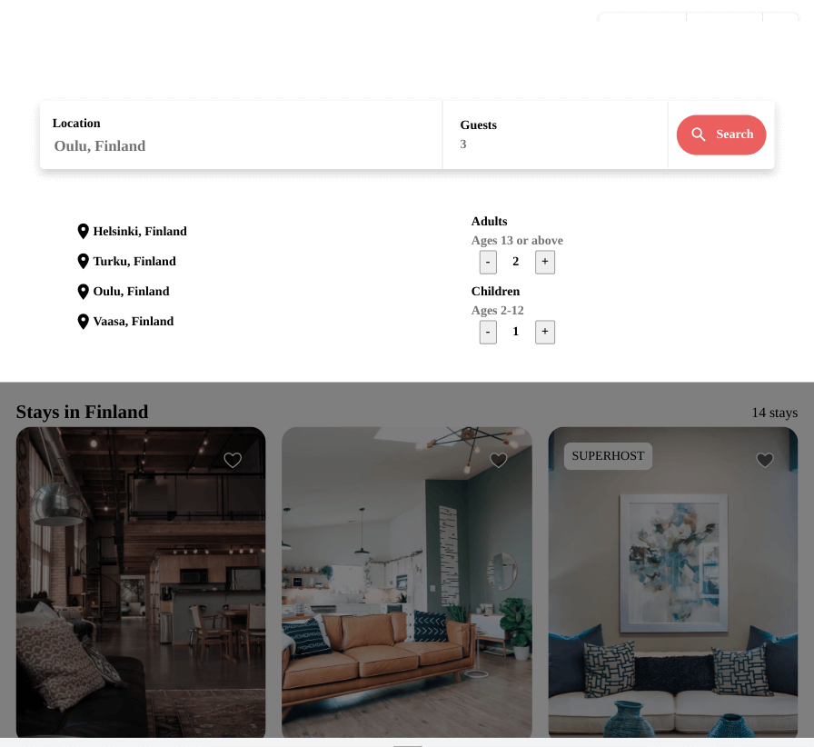
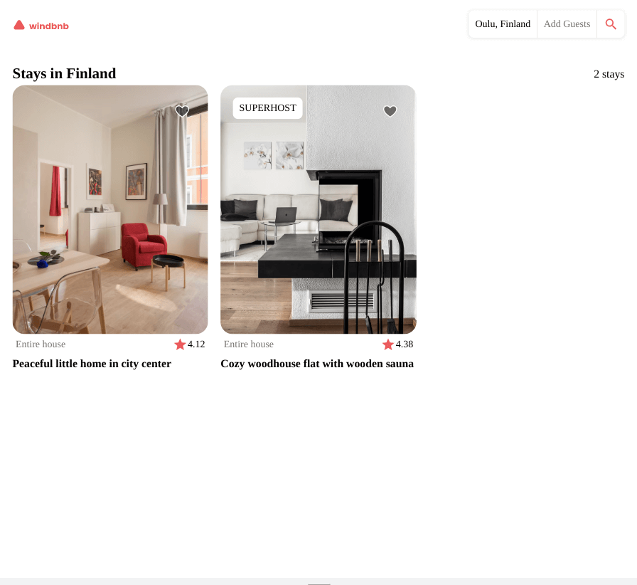

<h1 align="center">Windbnb</h1>

   Solution for a challenge from  <a href="http://devchallenges.io" target="_blank">Devchallenges.io</a>.

  <h3>
    <a href="https://jdegand.github.io/windbnb">
      Live Link
    </a>
     | 
    <a href="https://devchallenges.io/challenges/3JFYedSOZqAxYuOCNmYD">
      Challenge
    </a>
  </h3>

## Table of Contents

- [Overview](#overview)
  - [Built With](#built-with)
- [Features](#features)
- [Useful Resources](#useful-resources)

## Overview

### Built With

- [React](https://reactjs.org/)

## Features

This application/site was created as a submission to a [DevChallenges](https://devchallenges.io/challenges) challenge. The [challenge](https://devchallenges.io/challenges/3JFYedSOZqAxYuOCNmYD) was to build an application to complete the given user stories.

## Useful Resources

- [CodeSandbox](https://codesandbox.io/s/heuristic-shamir-uvkxc) - modal with form
- [CodeSandbox](https://codesandbox.io/s/currying-breeze-8llqgv) - locked modal
- [Dev.to](https://dev.to/link2twenty/react-using-portals-to-make-a-modal-2kdf) - react portals
- [Stack Overflow](https://stackoverflow.com/questions/63074577/close-modal-popup-using-esc-key-on-keyboard) - esc key to close modal
- [Stack Overflow](https://stackoverflow.com/questions/59017954/react-close-modal-on-click-outside#:~:text=But%20if%20you%20click%20on,body%20will%20close%20the%20modal.) - click outside modal to close
- [YouTube](https://www.youtube.com/watch?v=eWO1b6EoCnQ) - click outside to close hook
- [YouTube](https://www.youtube.com/watch?v=mwb6zgs9peU) - click outside to close
- [Blog](https://javascript.plainenglish.io/using-forwardref-with-react-hooks-9d0d096ad810) - forwardRef
- [YouTube](https://www.youtube.com/watch?v=f76ZAvCDWZI) - detect outside click of a modal
- [Stack Overflow](https://stackoverflow.com/questions/54989513/react-prevent-scroll-when-modal-is-open) - prevent scroll
- [Microsoft Forum](https://social.msdn.microsoft.com/Forums/en-US/d208e967-868c-4dde-8e3e-a549b3d2bdcd/problem-when-pressing-enter-key-in-a-textbox?forum=aspwebforms) - default button
- [Stack Overflow](https://stackoverflow.com/questions/925334/how-is-the-default-submit-button-on-an-html-form-determined) - first button was triggered when pressing enter when input focused.  That caused my guests panel to display.  I had the guest section as a button.
- [Stack Overflow](https://stackoverflow.com/questions/7060750/detect-the-enter-key-in-a-text-input-field) - detect enter key 
- [Stack Overflow](https://stackoverflow.com/questions/895171/prevent-users-from-submitting-a-form-by-hitting-enter) - prevent users from submitting a form by hitting enter
- [Stack Overflow](https://stackoverflow.com/questions/12692089/preventing-double-borders-in-css) - double borders
- [Codepen](https://codepen.io/dcode-software/pen/oNeyjeR) - button group
- [Stack Overflow](https://stackoverflow.com/questions/12546499/tint-image-using-css-without-overlay) - overlay
- [Idea Base Kent](https://ideabasekent.com/wiki/adding-image-overlay-tint-using-css) - image overlay
- [CSS Tricks](https://css-tricks.com/prevent-page-scrolling-when-a-modal-is-open/) - prevent page scrolling
